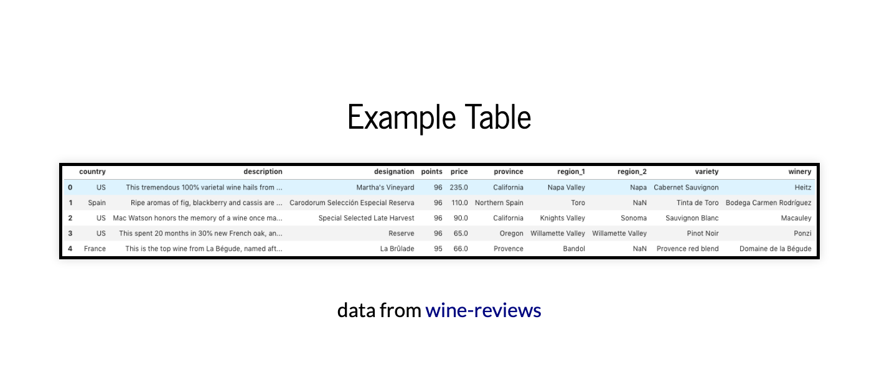

# Wine analysis with hypothesis testing 


A wine analysis presented by [reveal.js](https://revealjs.com/) (2018)

## Overview




1. Install dependencies
   ```sh
   $ yarn install
   ```

2. Serve the presentation and monitor source files for changes
   ```sh
   $ yarn start
   ```

3. Open <http://localhost:8000> to view presentation
